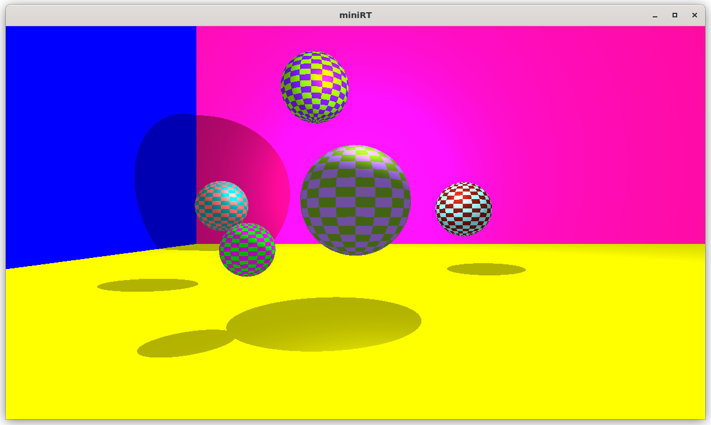

# 42MiniRT

This project is an introduction to Raytracing: a simulation of light and its interactions with physical objects with the help of mathematical formulas and the MLX42 graphics library.

Made by [pebencze](https://github.com/pebencze) and [vados-sa](https://github.com/vados-sa).

## Examples 🎬
<p float="left">
  
  
  
  
  
  

</p>


## Features 🪩
* smooth window management (minimizing, resizing, ESC, cross etc.)
* rendering of 3 colored geometric objects: plane, sphere, cylinder
* handling of all possible intersections and the inside of the object
* possibility of: resizing, translation, rotation in the .rt file
* moving around with arrows and WASD keys or zooming with + and -
* light management: spot brightness, hard shadows, ambient lighting
* clean memory management
* parsing of a .rt file with specific error messages
* bonus: checkerboard for planes and spheres, multi- and colored light

## The .rt File 📃
The .rt file will be executed with our miniRT and it contains information on the scene: on the light, the camera and the objects.<br/>
Below you can find an example and comments about the content of the elements.<br/>
To get familiar with the .rt file, we recommend you to play around with it,
change the values and see what image you get when executing miniRT with the new scene. Have fun!
```python
# Ambient lighting: Ratio (0.0 - 1.0), Color (rgb values 0 - 255)
A       0.5       255,255,255

# Camera: Coordinates, Direction (unit or normalized vector), Horizontal field of view (0 - 180 degrees)
C       0,0,-3    0,0,1    90

# Light: Coordinates, Intensity (0 - 1.0), Color
L       1.5,3,0   0.4      122,0,0

# Sphere: Coordinates, Diameter, Color
sp      0,0,0     2        255,255,255

# Plane: Coordinates, Normal (perpendicular vector to the surface), Color
pl      0,-1,0    0,1,0    255,255,255

# Cylinder: Coordinates, Axis (normalized), Diameter, Height, Color
cy      0,0,1     0,-1,0   1      2      0,0,255
```

## Usage 🛠
1. clone the repository and go to the directory<br/>
	```c
	git clone git@github.com:pebencze/42MiniRT.git && cd 42MiniRT
	```
2. run make<br/>
	```c
	make
	```
3. execute the file with a scene of your choice<br/>
	```c
	./miniRT scenes/*.rt
	```
4. play around and change the color, the position, the axis
or the dimensions of the objects in the .rt files; execute miniRT again<br/>
	```c
	//white plane perpendicular to the y-axis
	pl    0,-1,0       0,1,0                    255,255,255
	//red plane perpendicular to the z-axis
	pl    0,-1,0       0,0,1                    255,0,0
	```
5. move around in the scene or resize the window:
	- W, A, S, D for rotation
	- up, down, left, right for translation
	- '+' and '-' for zooming
	 <p float="right">
	  
	</p>

6. remove the object files and the executable<br/>
	```c
	make fclean
	```
7. see the bonus features: now you can  have several light parameters with different colors in the .rt file; play around with that <br/>
	```c
	make bonus
	./miniRT_bonus scenes/bonus/multi_light.rt
	```
8. see more bonus features: set the flags to 1 in the `incl/minirt_bonus.h` header file to have checkerboard patterns or specular light<br/>
	```c
	# define CHECKP 1 //checkerboard for plane
	# define CHECKS 1 //checkerboard for sphere
	# define SPECULAR 1 //specular light
	```
9. recompile and execute the bonus<br/>
	```c
	make re_bonus
	./miniRT_bonus scenes/bonus/checker_board.rt
	```
## Useful Links 📎
These were our main resources throughout the project and they are also useful if you are
unfamiliar with raytracing and just found our repository.<br/>
General Guides:
* [Raytracing In One Weekend by Peter Shirley et al.](https://raytracing.github.io/)
* [Fundamentals of Ray Tracing by Don Cross](http://cosinekitty.com/raytrace/raytrace_us.pdf)
* [the famous scratchapixel website to get started](https://www.scratchapixel.com/)

<br/>Specific Guides: <br/>
* [how to apply checkerboard patterns](http://raytracerchallenge.com/bonus/texture-mapping.html)
* [different types of lighting](https://learnopengl.com/Lighting/Basic-Lighting)
* [ray-shape intersection](https://hugi.scene.org/online/hugi24/coding%20graphics%20chris%20dragan%20raytracing%20shapes.htm)
* [geometry, coordinate systems, vector operations](https://www.scratchapixel.com/lessons/mathematics-physics-for-computer-graphics/geometry/points-vectors-and-normals.html)
* [MLX42 docs, how and what mlx functions to use](https://github.com/codam-coding-college/MLX42/tree/master/docs)

## Limitations 💭
* still reachable memory due to MLX42, suppression file available (mlx42.supp)
* with the keys W and S only 180 degrees of rotation are possible
* slow movement or rendering if the scene contains many objects, but since we refer to the identical memory address for all intersections with the same object,
the implementation of multithreading would require changes in several files or structures
