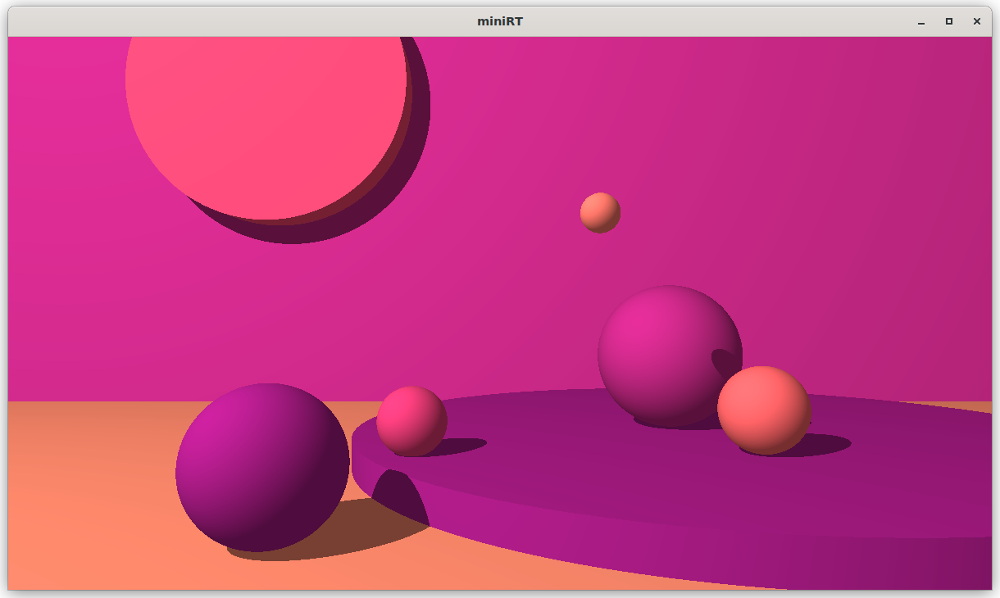
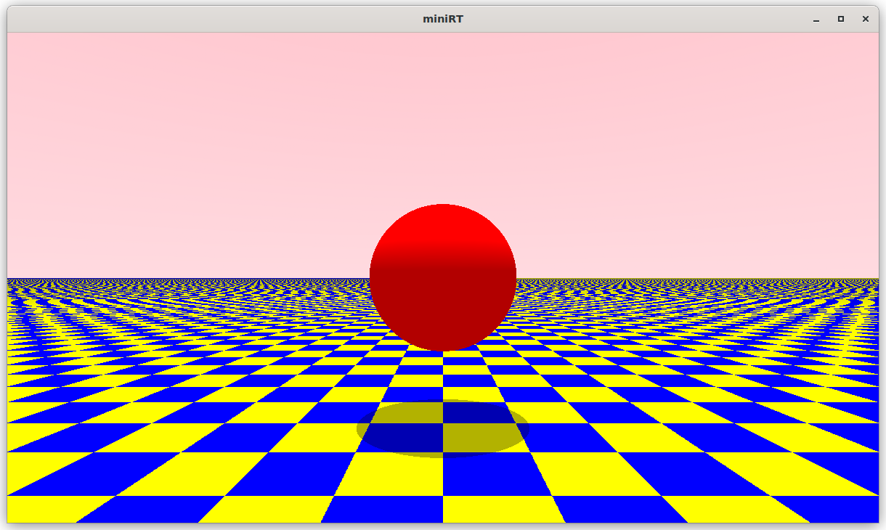
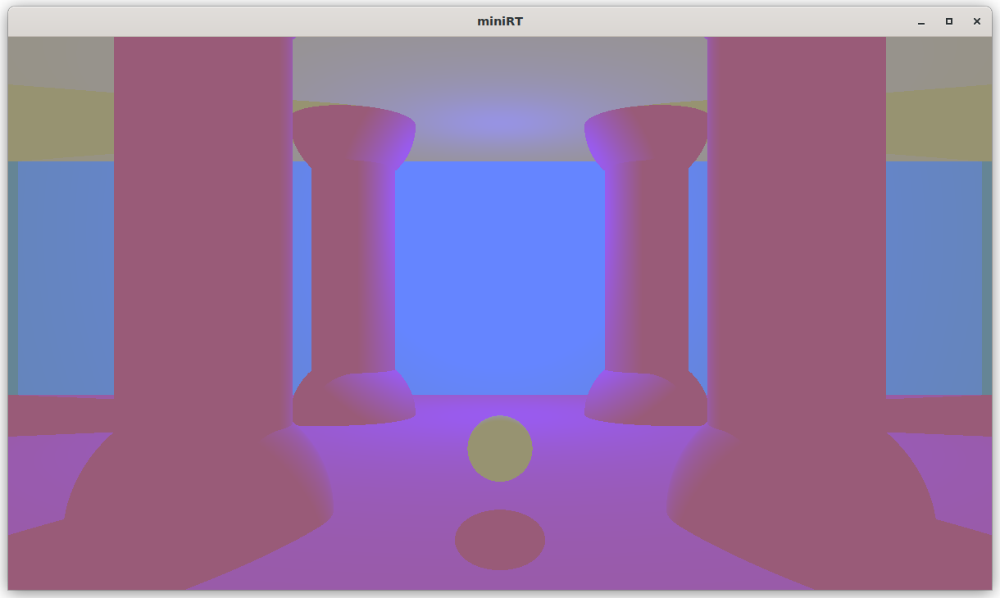

# 42MiniRT

This project is an introduction to Raytracing: a simulation of light and its interactions with physical objects with the help of mathematical formulas and the MLX42 graphics library.

Made by [pebencze](https://github.com/pebencze) and [vados-sa](https://github.com/vados-sa).

## Examples

## Features
* smooth window management (minimizing, resizing, ESC, cross etc.)
* rendering of 3 colored geometric objects: plane, sphere, cylinder
* handling of all possible intersections and the inside of the object
* possibility of: resizing, translation, rotation in the .rt file
* moving around with arrows and WASD keys
* light management: spot brightness, hard shadows, ambient lighting
* clean memory management (however, still reachables after running valgrind because of MLX42; we free everything we allocated)
* parsing of a .rt file with specific error messages
* bonus: checkerboard for planes and spheres, multi- and colored light

## Usage
1. clone the repository and go to the directory</b>
`git clone git@github.com:pebencze/42MiniRT.git && cd 42MiniRT`
2. run make </b>
`make`
3. execute the file with a scene of your choice</b>
`./miniRT scenes/*`

## Useful links
* [the famous scratchapixel website to get started](https://www.scratchapixel.com/)
* [checkerboards](http://raytracerchallenge.com/bonus/texture-mapping.html)
* [lighting](https://learnopengl.com/Lighting/Basic-Lighting)
* [Raytracing In One Weekend by Peter Shirley et al.](https://raytracing.github.io/)
* [Fundamentals of Ray Tracing by Don Cross](http://cosinekitty.com/raytrace/raytrace_us.pdf)
* [geometry](https://www.scratchapixel.com/lessons/mathematics-physics-for-computer-graphics/geometry/points-vectors-and-normals.html)
* [MLX42 docs](https://github.com/codam-coding-college/MLX42/tree/master/docs)