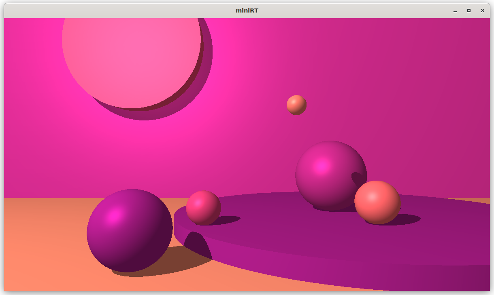
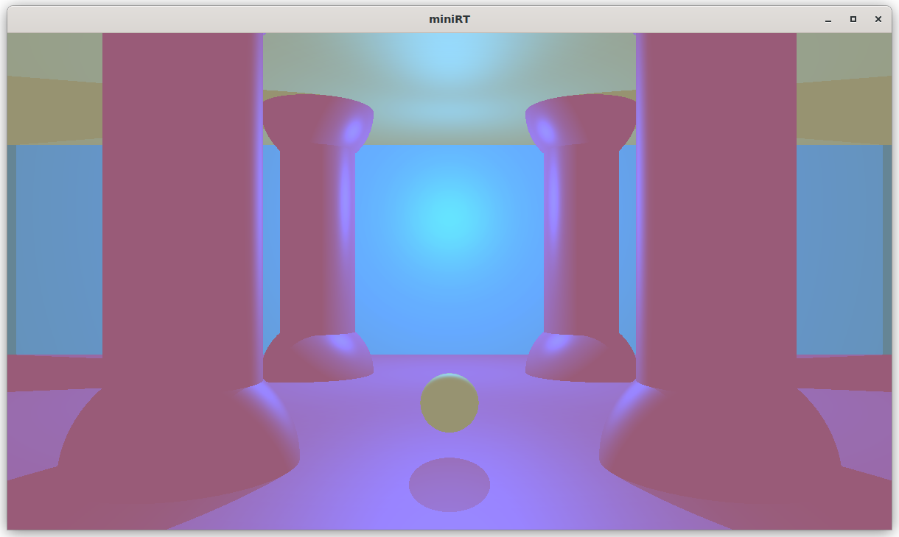
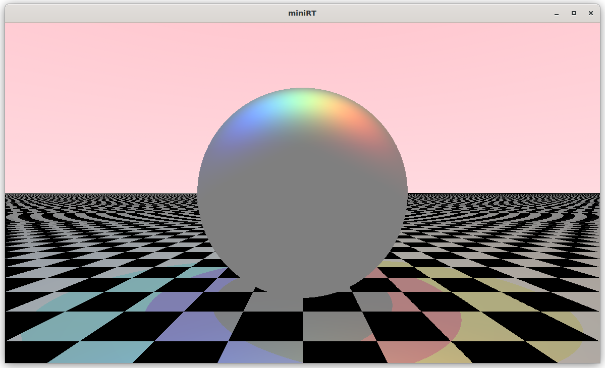
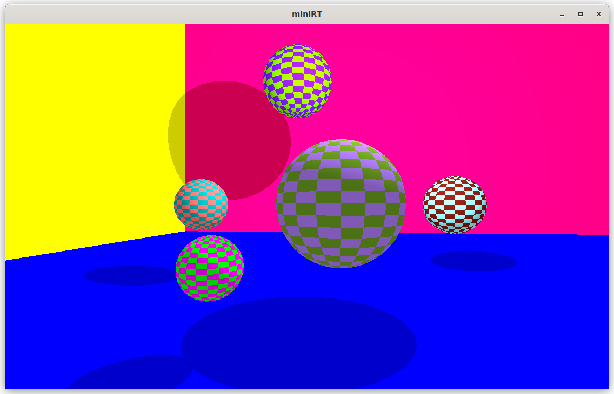
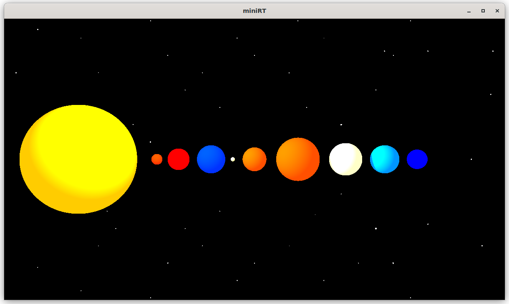
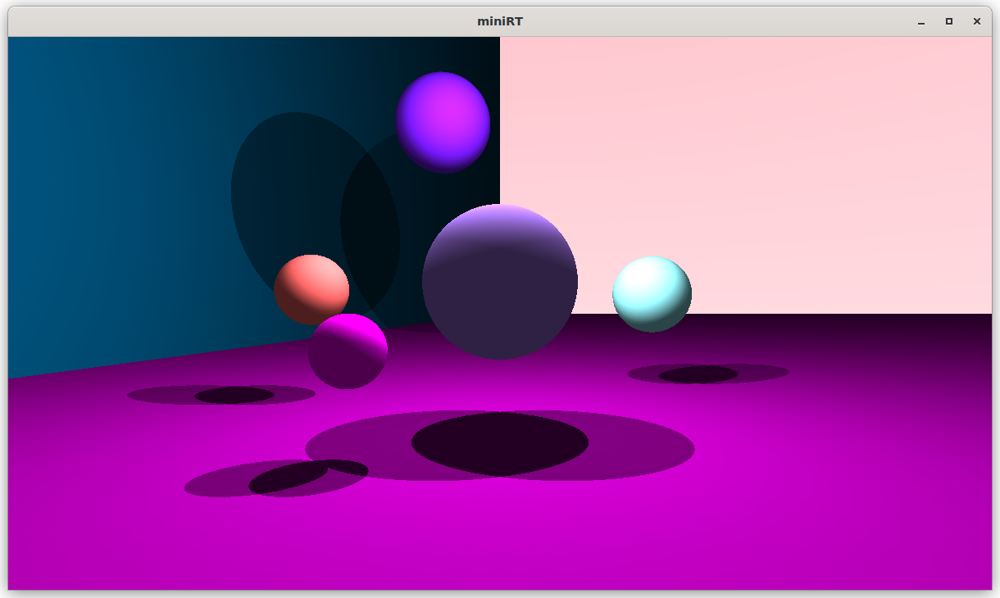

# 42MiniRT

This project is an introduction to Raytracing: a simulation of light and its interactions with physical objects with the help of mathematical formulas and the MLX42 graphics library.

Made by [pebencze](https://github.com/pebencze) and [vados-sa](https://github.com/vados-sa).

## Examples

## Features
* smooth window management (minimizing, resizing, ESC, cross etc.)
* rendering of 3 colored geometric objects: plane, sphere, cylinder
* handling of all possible intersections and the inside of the object
* possibility of: resizing, translation, rotation in the .rt file
* moving around with arrows and WASD keys or zooming with + and -
* light management: spot brightness, hard shadows, ambient lighting
* clean memory management (however, still reachables after running valgrind because of MLX42; we free everything we allocated)
* parsing of a .rt file with specific error messages
* bonus: checkerboard for planes and spheres, multi- and colored light

## Usage
1. clone the repository and go to the directory 
`git clone git@github.com:pebencze/42MiniRT.git && cd 42MiniRT`
2. run make or make bonus 
`make` or 
`make bonus`
3. execute the file with a scene of your choice 
`./miniRT scenes/*.rt` or 
`./miniRT_bonus scenes/*.rt`

## Useful links
These were our main resources throughout the project and they are also useful if you are
unfamiliar with raytracing and just found our repository. 
General Guides:
* [Raytracing In One Weekend by Peter Shirley et al.](https://raytracing.github.io/)
* [Fundamentals of Ray Tracing by Don Cross](http://cosinekitty.com/raytrace/raytrace_us.pdf)
* [the famous scratchapixel website to get started](https://www.scratchapixel.com/)  
Specific Guides:  
* [how to apply checkerboard patterns](http://raytracerchallenge.com/bonus/texture-mapping.html)
* [different types of lighting](https://learnopengl.com/Lighting/Basic-Lighting)
* [ray-shape intersection](https://hugi.scene.org/online/hugi24/coding%20graphics%20chris%20dragan%20raytracing%20shapes.htm)
* [geometry, coordinate systems, vector operations](https://www.scratchapixel.com/lessons/mathematics-physics-for-computer-graphics/geometry/points-vectors-and-normals.html)
* [MLX42 docs, how and what mlx functions to use](https://github.com/codam-coding-college/MLX42/tree/master/docs)

## Limitations
* still reachable memory due to MLX42, suppression file available (mlx42.supp)
* with the keys W and S only 180 degrees of rotation are possible
* slow movement or rendering if the scene contains many objects
* since we refer to the identical memory address for all intersections with the same object,
the implementation of multithreading would require changes in several files or structures
